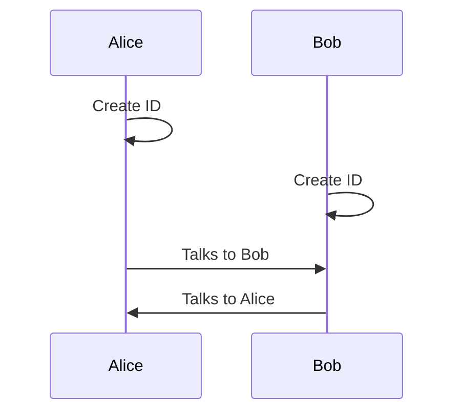
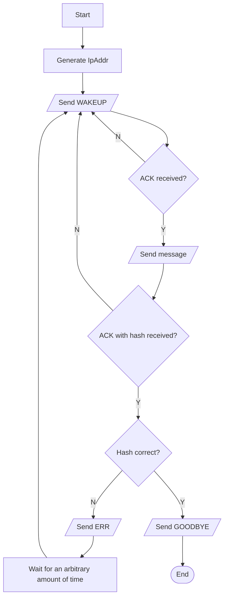
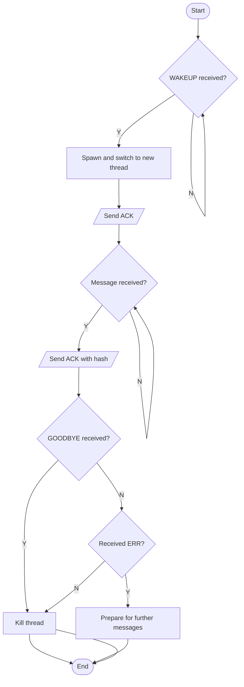

# p2pass
> A low-level p2p message passing library for Rust
## Simplicity for the end user
- All that is needed is either an IP and a port, or a base64 encoded p2pass id

## Overall Process

## POV: Alice

## POV: Bob

